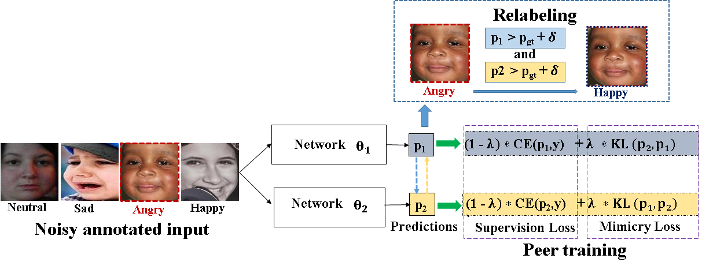

# Cocuring

<strong> Our proposed Co-curing framework for FER under noisy annotations:<strong>

Accepted for publication in ICTACT Journal on Image and Video Processing (IJIVP), 2021
  

  
  
<strong> Confusion plots for benchmark in-the-wild datasets are shown below: <strong>

    
    
Contact: darshangera@sssihl.edu.in
  
Acknowledgments:
We dedicate this work to Bhagawan Sri Sathya Sai Baba, Divine Founder Chancellor of Sri Sathya Sai Institute of Higher Learning, PrasanthiNilyam, A.P., India.

    
